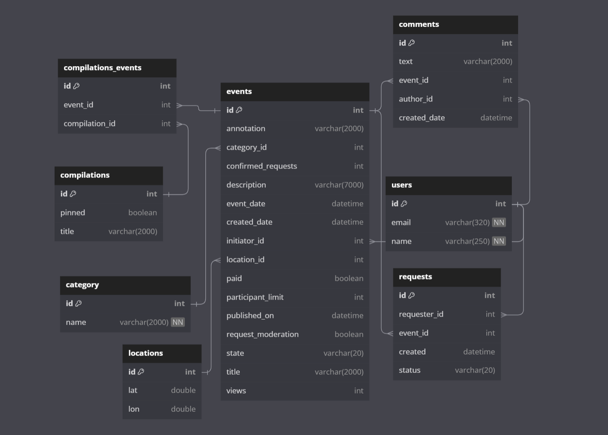
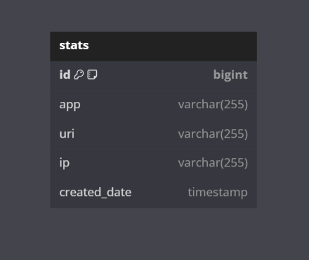

# Backend приложение "Афиша для поиска попутчиков и досуга"

## Описание
Программа представляет собой сервис для поиска попутчиков и организации досуга, такого как путешествия, походы в кино и другие мероприятия. Приложение состоит из двух микросервисов, которые взаимодействуют между собой через REST API.

### Основной сервис
Основной сервис содержит всю основную логику продукта, включая функционал поиска попутчиков и организации досуга.

### Сервис статистики
Сервис статистики отвечает за сбор информации о количестве просмотров, которая используется для анализа работы приложения.

## API
API основного сервиса разделено на три части:
- **Публичная** - доступная для всех пользователей
- **Закрытая** - доступная для авторизованных пользователей
- **Административная** - доступная для администраторов сервиса

## Технологии
- Java
- Spring Boot
- Spring Data JPA
- Hibernate ORM
- Docker
- Микросервисы
- PostgreSQL (для хранения данных)
- Docker Compose (для управления многоконтейнерным приложением и настройки сети между сервисами)

## Структура проекта
- `main-service/` - Основной сервис
    - `Dockerfile` - Файл для сборки Docker-образа основного сервиса
    - `src/` - Исходный код основного сервиса
- `stats-service/` - Сервис статистики
    - `Dockerfile` - Файл для сборки Docker-образа сервиса статистики
    - `src/` - Исходный код сервиса статистики
- `docker-compose.yml` - Файл для настройки и запуска многоконтейнерного приложения с помощью Docker Compose

## Запуск приложения
1. Убедитесь, что у вас установлен Docker и Docker Compose
2. Клонируйте репозиторий с проектом
3. Перейдите в корневую директорию проекта
4. Запустите приложение с помощью команды `docker-compose up`

## База данных
Для хранения данных оба сервиса используют базу данных PostgreSQL. Взаимодействие с базой данных происходит с помощью Spring Data JPA и Hibernate ORM.

Схемы баз дынных 

MIAN SERVICE DB

STAT SERVICE DB 

